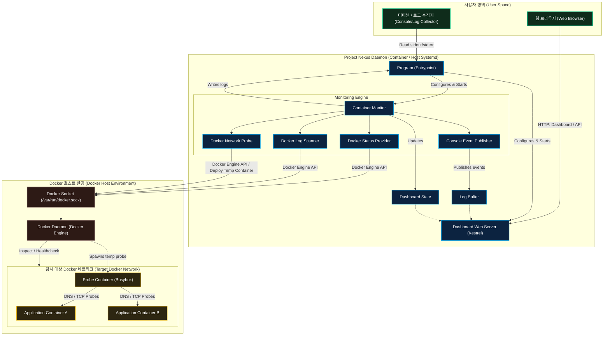
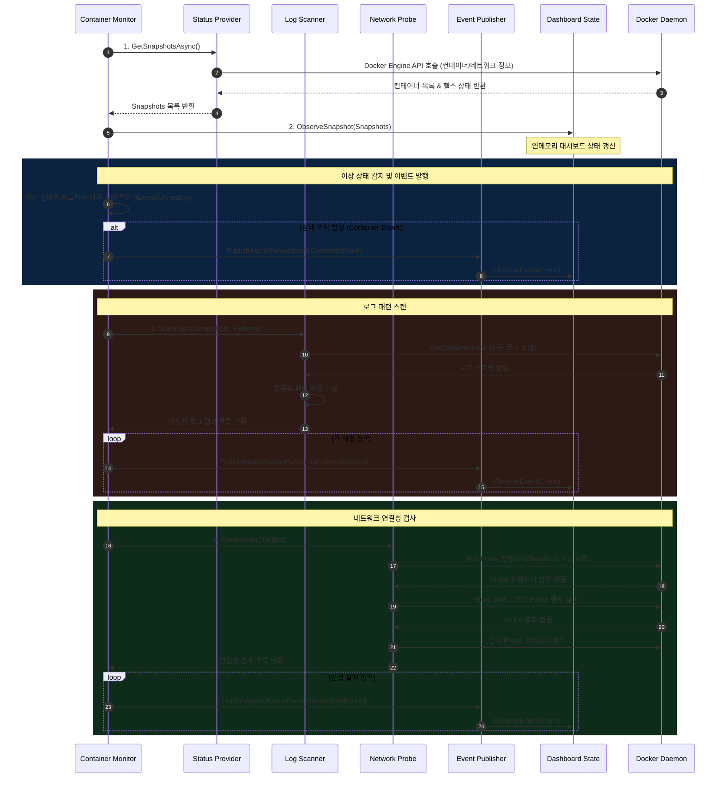

### 컴포넌트 아키텍처 다이어그램

```mermaid
graph TB
    %% Styling
    classDef daemon fill:#0c2340,stroke:#0ea5e9,stroke-width:2px,color:#fff;
    classDef docker fill:#2d1a15,stroke:#a1887f,stroke-width:2px,color:#fff;
    classDef client fill:#0f2c1b,stroke:#10b981,stroke-width:2px,color:#fff;
    classDef network fill:#2d2611,stroke:#eab308,stroke-width:2px,color:#fff;

    %% Nodes
    subgraph UserSpace["사용자 영역 (User Space)"]
        Browser["웹 브라우저 (Web Browser)"]:::client
        Terminal["터미널 / 로그 수집기 (Console/Log Collector)"]:::client
    end

    subgraph Nexus["Project Nexus Daemon (Container / Host Systemd)"]
        Program["Program (Entrypoint)"]:::daemon
        WebServer["Dashboard Web Server (Kestrel)"]:::daemon
        LogBuffer["Log Buffer"]:::daemon
        DashboardState["Dashboard State"]:::daemon
        
        subgraph Core["Monitoring Engine"]
            Monitor["Container Monitor"]:::daemon
            Provider["Docker Status Provider"]:::daemon
            Scanner["Docker Log Scanner"]:::daemon
            Probe["Docker Network Probe"]:::daemon
            Publisher["Console Event Publisher"]:::daemon
        end
    end

    subgraph DockerHost["Docker 호스트 환경 (Docker Host Environment)"]
        Socket["Docker Socket (/var/run/docker.sock)"]:::docker
        Daemon["Docker Daemon (Docker Engine)"]:::docker
        
        subgraph TargetNet["감시 대상 Docker 네트워크 (Target Docker Network)"]
            App1["Application Container A"]:::network
            App2["Application Container B"]:::network
            ProbeContainer["Probe Container (Busybox)"]:::network
        end
    end

    %% Connections
    Browser -->|HTTP: Dashboard / API| WebServer
    Terminal -->|Read stdout/stderr| Program
    Program -->|Configures & Starts| WebServer
    Program -->|Configures & Starts| Monitor
    
    %% Output bindings
    LogBuffer -.-> WebServer
    DashboardState -.-> WebServer
    Monitor -->|Updates| DashboardState
    Monitor -->|Writes logs| Program
    Publisher -->|Publishes events| LogBuffer
    
    %% Monitoring dependencies
    Monitor --> Provider
    Monitor --> Scanner
    Monitor --> Probe
    Monitor --> Publisher
    
    Provider -->|Docker Engine API| Socket
    Scanner -->|Docker Engine API| Socket
    Probe -->|Docker Engine API / Deploy Temp Container| Socket
    Socket --> Daemon
    
    Daemon -->|Inspect / Healthcheck| TargetNet
    ProbeContainer -->|DNS / TCP Probes| App1
    ProbeContainer -->|DNS / TCP Probes| App2
    Daemon -.->|Spawns temp probe| ProbeContainer
```

### 모니터링 주기 시퀀스 다이어그램

```mermaid
sequenceDiagram
    autonumber
    participant CM as Container Monitor
    participant SP as Status Provider
    participant LS as Log Scanner
    participant NP as Network Probe
    participant EP as Event Publisher
    participant DS as Dashboard State
    participant DH as Docker Daemon

    CM->>SP: 1. GetSnapshotsAsync()
    SP->>DH: Docker Engine API 호출 (컨테이너/네트워크 정보)
    DH-->>SP: 컨테이너 목록 & 헬스 상태 반환
    SP-->>CM: Snapshots 목록 반환
    
    CM->>DS: 2. ObserveSnapshot(Snapshots)
    note over DS: 인메모리 대시보드 상태 갱신
    
    rect rgb(12, 35, 64)
        note over CM, DH: 이상 상태 감지 및 이벤트 발행
        CM->>CM: 이전 상태와 비교하여 다운 상태 확인 (Exited/Unhealthy)
        alt 상태 변화 발생 (Container Down)
            CM->>EP: PublishAsync(NexusEvent.ContainerDown)
            EP->>DS: ObserveEvent(Event)
        end
    end

    rect rgb(45, 26, 21)
        note over CM, DH: 로그 패턴 스캔
        CM->>LS: 3. ScanAsync(Snapshots, Patterns)
        LS->>DH: GetContainerLogs (최근 로그 조회)
        DH-->>LS: 로그 스트림 반환
        LS->>LS: 정규식 패턴 매칭 수행
        LS-->>CM: 매칭된 로그 결과 목록 반환
        loop 각 매칭 항목
            CM->>EP: PublishAsync(NexusEvent.LogPatternMatched)
            EP->>DS: ObserveEvent(Event)
        end
    end

    rect rgb(15, 44, 27)
        note over CM, DH: 네트워크 연결성 검사
        CM->>NP: 4. ProbeAsync(Targets)
        NP->>DH: 임시 Probe 컨테이너(Busybox) 기동 요청
        DH-->>NP: Probe 컨테이너 실행 완료
        NP->>DH: Exec DNS / TCP Probe 명령 실행
        DH-->>NP: Probe 결과 반환
        NP->>DH: 임시 Probe 컨테이너 제거
        NP-->>CM: 연결성 결과 목록 반환
        loop 연결 실패 항목
            CM->>EP: PublishAsync(NexusEvent.ConnectivityFailed)
            EP->>DS: ObserveEvent(Event)
        end
    end
```