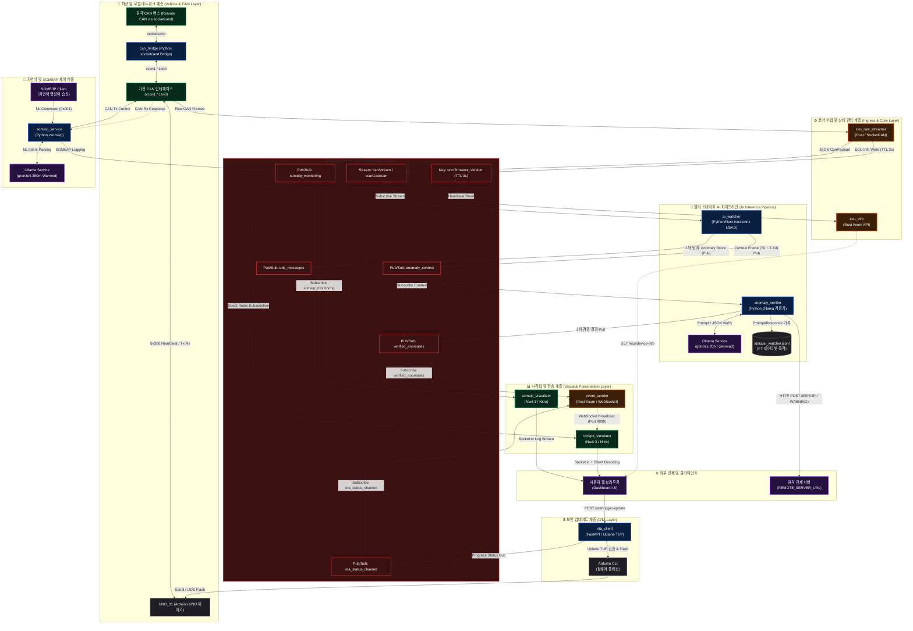

### 아키텍처 다이어그램

```mermaid
flowchart TD
    %% Styling
    classDef rust fill:#3c1f08,stroke:#ea580c,stroke-width:2px,color:#fff;
    classDef python fill:#0a2040,stroke:#2563eb,stroke-width:2px,color:#fff;
    classDef node fill:#072b1b,stroke:#059669,stroke-width:2px,color:#fff;
    classDef redis fill:#3b1111,stroke:#dc2626,stroke-width:2px,color:#fff;
    classDef hardware fill:#1e1e24,stroke:#52525b,stroke-width:2px,color:#fff;
    classDef external fill:#25113d,stroke:#9333ea,stroke-width:2px,color:#fff;

    subgraph Hardware_Layer["🚗 차량 및 로컬 네트워크 계층 (Vehicle & CAN Layer)"]
        remote_can["원격 CAN 버스 (Remote CAN via socketcand)"]
        can_bridge["can_bridge (Python socketcand Bridge)"]:::python
        vcan["가상 CAN 인터페이스 (vcan1 / can0)"]
        ecu_uno["UNO_01 (Arduino UNO 제어기)"]:::hardware
    end

    subgraph Ingress_Core_Layer["⚙️ 코어 수집 및 상태 관리 계층 (Ingress & Core Layer)"]
        can_streamer["can_raw_streamer<br>(Rust / SocketCAN)"]:::rust
        ecu_info["ecu_info<br>(Rust Axum API)"]:::rust
    end

    subgraph Redis_Broker["📦 Redis 메시지 브로커 (K3s Redis Cluster)"]
        r_stream["Stream: can/stream / vcan1/stream"]:::redis
        r_heartbeat["Key: uno:firmware_version (TTL 3s)"]:::redis
        r_context["Pub/Sub: anomaly_context"]:::redis
        r_uds["Pub/Sub: uds_messages"]:::redis
        r_verified["Pub/Sub: verified_anomalies"]:::redis
        r_ota["Pub/Sub: ota_status_channel"]:::redis
        r_someip["Pub/Sub: someip_monitoring"]:::redis
    end

    subgraph AI_Pipeline["🧠 멀티 스테이지 AI 파이프라인 (AI Inference Pipeline)"]
        ai_watcher["ai_watcher<br>(Python/Rust tract-onnx USAD)"]:::python
        anomaly_verifier["anomaly_verifier<br>(Python Ollama 검증기)"]:::python
        ollama_server["Ollama Service<br>(gpt-oss:20b / gemma3)"]:::external
        dataset_store[("/data/ai_watcher.jsonl<br>(FT 데이터셋 축적)")]:::hardware
    end

    subgraph Control_SOMEIP["💬 자연어 및 SOME/IP 제어 계층"]
        someip_client["SOME/IP Client<br>(자연어 명령어 송신)"]:::external
        someip_service["someip_service<br>(Python vsomeip)"]:::python
        ollama_someip["Ollama Service<br>(granite4:350m Warmed)"]:::external
    end

    subgraph OTA_Layer["🔒 보안 업데이트 계층 (OTA Layer)"]
        ota_client["ota_client<br>(FastAPI / Uptane TUF)"]:::python
        arduino_cli["Arduino CLI<br>(펌웨어 플래싱)"]:::hardware
    end

    subgraph Visual_Layer["📊 시각화 및 전송 계층 (Visual & Presentation Layer)"]
        event_sender["event_sender<br>(Rust Axum / WebSocket)"]:::rust
        cockpit_sim["cockpit_simulator<br>(Nuxt 3 / Nitro)"]:::node
        someip_vis["someip_visualizer<br>(Nuxt 3 / Nitro)"]:::node
    end

    subgraph External_Monitoring["🌐 외부 관제 및 클라이언트"]
        web_browser["사용자 웹 브라우저<br>(Dashboard UI)"]:::external
        remote_server["원격 관제 서버<br>(REMOTE_SERVER_URL)"]:::external
    end

    %% Flow Connections
    %% can_bridge & CAN Bus
    remote_can <-->|socketcand| can_bridge
    can_bridge <-->|vcan1 / can0| vcan
    ecu_uno <-->|"0x300 Heartbeat / Tx-Rx"| vcan

    %% streamer Ingress
    vcan -->|Raw CAN Frames| can_streamer
    can_streamer -->|JSON CanPayload| r_stream
    can_streamer -->|"ECU Info Write (TTL 3s)"| r_heartbeat

    %% ecu_info
    r_heartbeat -->|Heartbeat Read| ecu_info
    ecu_info -.->|GET /ecu/device-info| web_browser

    %% AI Pipeline Flow
    r_stream -->|Subscribe Stream| ai_watcher
    ai_watcher -->|"1차 탐지: Anomaly Score (Pub)"| r_uds
    ai_watcher -->|"Context Frame (T0 ~ T-10) Pub"| r_context
    r_context -->|Subscribe Context| anomaly_verifier
    anomaly_verifier <-->|Prompt / JSON Verify| ollama_server
    anomaly_verifier -->|Prompt/Response 기록| dataset_store
    anomaly_verifier -->|2차 검증 결과 Pub| r_verified
    anomaly_verifier -->|"HTTP POST (ERROR / WARNING)"| remote_server

    %% Control SOME/IP
    someip_client -->|"NL Command (0x001)"| someip_service
    someip_service <-->|NL Intent Parsing| ollama_someip
    someip_service -->|CAN Tx Control| vcan
    vcan -.->|CAN Rx Response| someip_service
    someip_service -->|SOME/IP Logging| r_someip

    %% OTA Flow
    web_browser -->|POST /ota/trigger-update| ota_client
    ota_client -->|Uptane TUF 검증 & Flash| arduino_cli
    arduino_cli -->|Serial / UDS Flash| ecu_uno
    ota_client -->|Progress Status Pub| r_ota

    %% Event Sender & Visual
    r_verified -->|Subscribe verified_anomalies| event_sender
    r_ota -->|Subscribe ota_status_channel| event_sender
    event_sender -->|"WebSocket Broadcast (Port 9999)"| cockpit_sim
    r_stream -->|Direct Redis Subscription| cockpit_sim
    cockpit_sim -->|Socket.io + Client Decoding| web_browser
    
    r_someip -->|Subscribe someip_monitoring| someip_vis
    someip_vis -->|Socket.io Log Stream| web_browser

    %% Subgraph Styling
    style Redis_Broker fill:#3b1111,stroke:#dc2626,stroke-width:2px;
```
